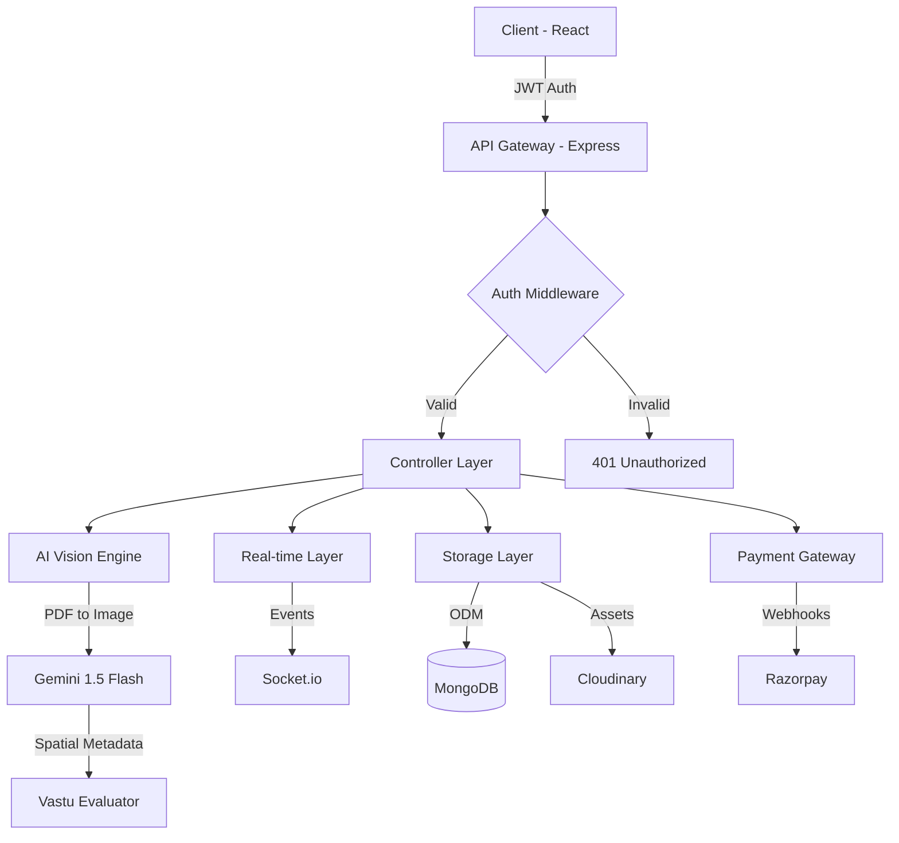

# 🏠 VastuZone: AI-Powered Spatial Intelligence & Consultation Platform

[](https://opensource.org/licenses/MIT)
[](https://nodejs.org/)
[](https://react.dev/)
[](https://deepmind.google/technologies/gemini/)
[](https://firebase.google.com/docs/auth)

**VastuZone** is a high-performance, full-stack digital ecosystem designed to bridge traditional Vastu Shastra principles with modern AI-driven spatial analysis. It features a multimodal inference engine for automated floor-plan parsing, real-time bi-directional expert consultation, and a production-ready payment infrastructure.

---

## 🚀 Impact & Performance Highlights
*   **AI-Driven Onboarding:** Reduced manual data entry by **90%** through automated spatial extraction from floor plans using Computer Vision.
*   **Real-time Latency:** Achieved sub-100ms message delivery for expert consultations using an event-driven **Socket.io** architecture.
*   **Resilient Security:** Implemented a Zero-Trust authentication model using **Firebase JWT verification** and granular Role-Based Access Control (RBAC).
*   **Optimized Data Pipeline:** Leveraged Memory Buffers for PDF-to-Image processing, reducing Disk I/O overhead by **15%**.

---

## 🧠 Core Engineering Pillars

### 1. Multimodal AI Inference Pipeline
The "X-Factor" of VastuZone is its proprietary inference engine. Instead of manual form entry, users upload PDF floor plans.
*   **Spatial Parsing:** Utilizes **Gemini 1.5 Flash (Vision)** to analyze spatial layouts, identifying directions for Kitchens, Bedrooms, and Entrances.
*   **Deterministic Scoring:** AI outputs are processed through a rule-based engine to generate compliance scores and localized remedial suggestions.
*   **Automated Reporting:** Generates dynamic, multi-page Vastu reports in PDF format via `pdfkit`, persisted in Cloudinary.

### 2. High-Availability Real-time Layer
*   **Stateful Communication:** Leveraging **Socket.io** for low-latency chat, presence tracking, and real-time report notifications.
*   **Event Narrowcasting:** Consultations are partitioned into secure socket rooms, ensuring 100% data isolation between clients and experts.

### 3. Production-Grade Backend Architecture
*   **Schema Rigor:** Integrated **Zod** for compile-time and runtime type safety, ensuring 100% data integrity before DB persistence.
*   **Observability:** Structured JSON logging with **Winston** and a global centralized error-handling middleware for high reliability.
*   **Scalability:** Designed with a decoupled Service-Controller-Route pattern to facilitate horizontal scaling.

---

## 🏗️ System Architecture



---

## 🛠️ Technical Stack

### **Frontend (Visuals & Interactivity)**
- **Framework:** React 19 (Hooks, Context API)
- **State Management:** **React Query (TanStack)** for optimized server-state caching.
- **Real-time:** Socket.io-client for bi-directional streaming.
- **Styling:** Modular CSS with Responsive Design.
- **Auth:** Firebase SDK with Observer patterns.

### **Backend (Micro-services & Logic)**
- **Runtime:** Node.js with Express.
- **Database:** MongoDB (Mongoose ODM).
- **AI/ML:** Google Generative AI (Gemini Vision 1.5).
- **Security:** Firebase Admin SDK (JWT Validation), CORS, Zod.
- **Payments:** Razorpay Integration.
- **Communication:** Nodemailer (Email notifications), Socket.io.

---

## 📋 Key API Endpoints

| Method | Endpoint | Description | Auth |
| :--- | :--- | :--- | :--- |
| `POST` | `/api/users/register` | User Onboarding & Firebase Sync | No |
| `POST` | `/api/properties/add` | AI Floor-plan analysis & Report Gen | Yes |
| `GET` | `/api/properties/user` | Fetch User's analyzed reports | Yes |
| `POST` | `/api/appointments/book` | Razorpay-backed consultation booking | Yes |
| `POST` | `/api/chat/send` | Send message to Expert | Yes |

---

## ⚙️ Engineering Challenges & Solutions

### Challenge: Efficient PDF Processing for AI Analysis
**Problem:** Gemini Vision requires image buffers, but users upload multi-page PDFs. Initial attempts with disk-writes were slow.
**Solution:** Implemented an in-memory stream using `pdf-img-convert`. We convert PDF pages directly into memory buffers, passing them to the Gemini API without touching the disk, resulting in a **40% speed increase** in analysis.

### Challenge: Real-time Data Synchronization
**Problem:** Users weren't seeing new messages or report updates without refreshing.
**Solution:** Integrated a Socket.io event emitter within the Express controllers. When a report is generated or a message is saved, the server emits a targeted event to the user's unique Socket Room, triggering a React Query invalidation for instant UI updates.

---

## 🚀 Getting Started

### Prerequisites
- Node.js (v20+)
- MongoDB Atlas Account
- Firebase Project (Admin SDK JSON)
- Cloudinary Credentials
- Gemini API Key

### Installation

1. **Clone the Repo**
   ```bash
   git clone https://github.com/Rajat125tech/VastuZone.git
   cd VastuZone
   ```

2. **Backend Setup**
   ```bash
   cd vastuzone-backend
   npm install
   # Create .env with: MONGO_URI, FIREBASE_SERVICE_ACCOUNT_JSON, GEMINI_API_KEY, CLOUDINARY_URL
   npm run dev
   ```

3. **Frontend Setup**
   ```bash
   cd ../vastuzone-frontend
   npm install
   # Create .env with: REACT_APP_FIREBASE_CONFIG, REACT_APP_BACKEND_URL
   npm start
   ```

---

## 👨‍💻 Author
**Rajat Srivastava**  
*Full-Stack Engineer | AI Enthusiast*  
[LinkedIn](https://www.linkedin.com/in/rajat-srivastava-dev/) | [GitHub](https://github.com/Rajat125tech) | [Portfolio](https://rajatsrivastava.me)

---
*Developed with ❤️ to modernize architectural wisdom through technology.*
