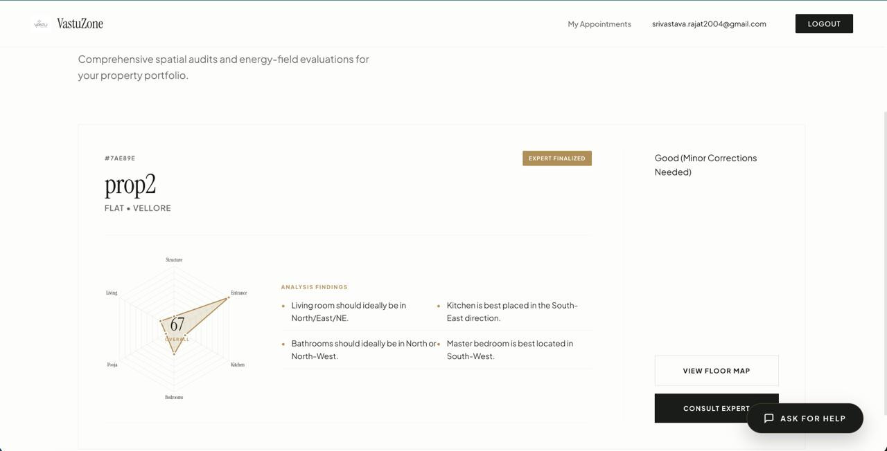
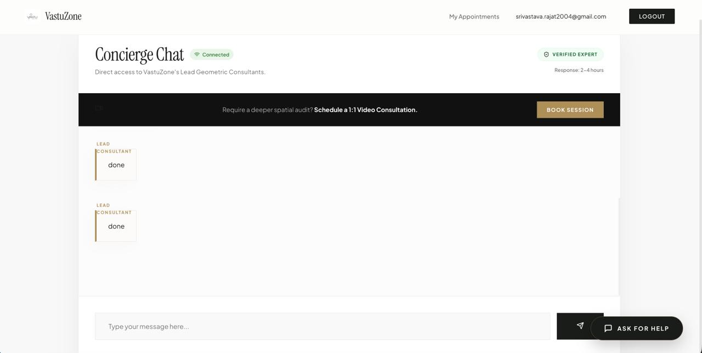

# 🏠 VastuZone – Smart Vastu Consultation Platform

[](#-tech-stack)
[](https://opensource.org/licenses/ISC)
[](https://reactjs.org/)
[](https://nodejs.org/)

**VastuZone** is a comprehensive, full-stack digital platform designed to bring traditional Vastu Shastra consultation into the modern age. It enables users to analyze their property's Vastu compliance through an automated scoring system, book expert consultations, chat in real-time with experts, and manage secure payments.

---

## 🚀 Features

### 👤 For Users
- **🔐 Secure Authentication:** Integrated with Firebase Auth for robust and secure user management.
- **🏘️ Property Management:** Easily add property details and upload floor plans for analysis.
- **📊 Automated Vastu Scoring:** Instant evaluation based on rule-based logic (directions, shapes, room placements).
- **📁 Detailed Reports:** View and manage comprehensive Vastu compliance reports for multiple properties.
- **💬 Real-time Expert Chat:** Seamless interaction with Vastu experts via Socket.io.
- **📅 Appointment Booking:** Schedule consultations at your convenience.
- **💳 Secure Payments:** Integrated with Razorpay for safe and easy transaction processing.
- **🎥 Virtual Consultations:** Access Google Meet links for expert sessions directly from the dashboard.

### 🧑‍💼 For Experts
- **🧾 Appointment Management:** View and manage a streamlined list of upcoming consultations.
- **🔗 Meeting Integration:** Easily add and share Google Meet links for booked sessions.
- **💬 Direct Chat:** Maintain communication with users regarding their Vastu concerns.
- **✅ Status Tracking:** Mark appointments as paid or completed with a single click.

---

## 🧠 Vastu Evaluation Logic

The core of VastuZone is its **Rule-Based Scoring Engine**, which calculates compliance based on:

| Factor | Weightage | Ideal Placements |
| :--- | :--- | :--- |
| **Facing** | High | North, East, North-East |
| **Entrance** | High | North, East |
| **Kitchen** | Medium | South-East |
| **Master Bedroom** | Medium | South-West |
| **Pooja Room** | Medium | North-East |
| **Shape** | Medium | Square, Rectangle |

### Final Score Classification
- 🟢 **80 - 100:** Excellent
- 🟡 **60 - 79:** Good (Minor Corrections Needed)
- 🔴 **Below 60:** Needs Vastu Remedies

---

## 🛠️ Tech Stack

### Frontend
- **Framework:** React.js (v19)
- **Routing:** React Router (v7)
- **State/Data Fetching:** React Query (@tanstack/react-query)
- **Real-time:** Socket.io-client
- **Visuals:** Chart.js, Lucide React (Icons)
- **Notifications:** Sonner (Toast notifications)
- **Auth:** Firebase Authentication

### Backend
- **Runtime:** Node.js
- **Framework:** Express.js (v5)
- **Database:** MongoDB with Mongoose ORM
- **Real-time:** Socket.io
- **Storage:** Cloudinary (via Multer)
- **Payments:** Razorpay SDK
- **Auth:** Firebase Admin SDK

---

## 📁 Project Structure

```text
VastuZone/
├── vastuzone-frontend/         # React Application
│   ├── src/
│   │   ├── assets/            # Static images & icons
│   │   ├── components/        # Reusable UI components
│   │   ├── pages/             # Main view components
│   │   ├── styles/            # CSS Modules & Global styles
│   │   ├── utils/             # Helper functions (authFetch, etc.)
│   │   └── firebase.js        # Firebase configuration
│   └── package.json
├── vastuzone-backend/          # Node.js API
│   ├── config/                # DB and Cloudinary configs
│   ├── middleware/            # Auth and Upload middlewares
│   ├── models/                # Mongoose schemas (User, Property, Appointment, etc.)
│   ├── routes/                # API endpoints
│   ├── utils/                 # Evaluation logic, Email & Razorpay helpers
│   └── server.js              # Entry point
├── screenshots/               # Project preview images
└── README.md                  # Project documentation
```

---

## ⚙️ Installation & Setup

### 1️⃣ Clone the Repository
```bash
git clone https://github.com/Rajat125tech/VastuZone.git
cd VastuZone
```

### 2️⃣ Backend Setup
```bash
cd vastuzone-backend
npm install
```
Create a `.env` file in `vastuzone-backend/`:
```env
PORT=5001
MONGO_URI=your_mongodb_connection_string
FIREBASE_PROJECT_ID=your_firebase_project_id
RAZORPAY_KEY_ID=your_razorpay_key
RAZORPAY_KEY_SECRET=your_razorpay_secret
CLOUDINARY_NAME=your_cloud_name
CLOUDINARY_KEY=your_api_key
CLOUDINARY_SECRET=your_api_secret
```
Run the server:
```bash
npm run dev
```

### 3️⃣ Frontend Setup
```bash
cd ../vastuzone-frontend
npm install
```
Create a `.env` file in `vastuzone-frontend/`:
```env
REACT_APP_FIREBASE_API_KEY=your_api_key
REACT_APP_FIREBASE_AUTH_DOMAIN=your_auth_domain
REACT_APP_FIREBASE_PROJECT_ID=your_project_id
REACT_APP_FIREBASE_STORAGE_BUCKET=your_storage_bucket
REACT_APP_FIREBASE_MESSAGING_SENDER_ID=your_sender_id
REACT_APP_FIREBASE_APP_ID=your_app_id
```
Run the application:
```bash
npm start
```

---

## 📸 Screenshots

| Dashboard | Vastu Report | Chat Interface |
| :---: | :---: | :---: |
|  |  |  |

---

## 🔒 Security
- **JWT & Firebase:** Authentication is handled by Firebase, with tokens verified on the backend.
- **Environment Variables:** Sensitive keys (Razorpay, Cloudinary, DB) are managed via `.env` files.
- **Protected Routes:** Both frontend components and backend endpoints are guarded by authentication middleware.

---

## 👨‍💻 Author

**Rajat Srivastava**  
🎓 AI/ML Student @ VIT Vellore  
📍 Vellore, India  

---

## 📜 License
This project is licensed under the **ISC License**.
